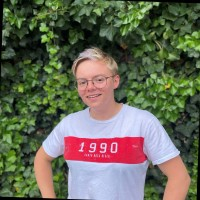

# markdown-challenge

#Vittoria

_A day without learning is a day lost._ Romain Guilleaumes

## I'm a very Swiss knife ! ##

| Questions | Answers |
|:-----------------------:|:-----------------------:|
| Birthday: | 13 may |
| Favorite color: | Blue (of course) |
| Favorite food: | PASTA |
| Pinneapple on pizza: | YES |

## Hobbies ##

* Travel
    * Van life
    * Backpack
    * Survival
    * Discovery
    
* Ride on my motorbike

* Manual Work
    * Make the development of a van or a car
    * Create wooden object
    * My second name is Bob the handyman
    
    * Save lifes

* Learn about psychology

* And the best for the end LEARNING CODE

## You can always count on me when... ##

I'm THE friend you can call at any time for anything.
I'm always on a good mood (of I try...) and if you need to talk of everything, I'm hier!
I organize the wedding of firnds from Brussels, I prepare some trips so I love to arrange something.
And of course, **_I'm Vitto the handyman with~~out~~ my Swiss knife !_**

## A funny story ##

My computer isn't fast so I take more time than the oders.
He loves to bug and crash but he's still alive (from time to time).

### Santa, can I get a new computer more powerfull ? ###

<< [previous](https://github.com/GeorisVal/markdown-challenge) || Vittoria || [next](https://github.com/Nimarho/markdown-challenge) >>
